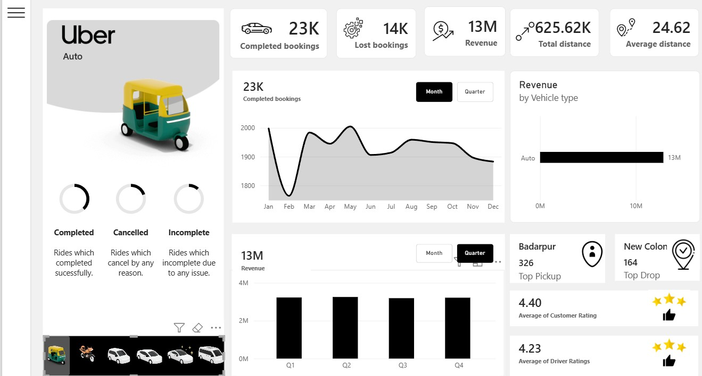
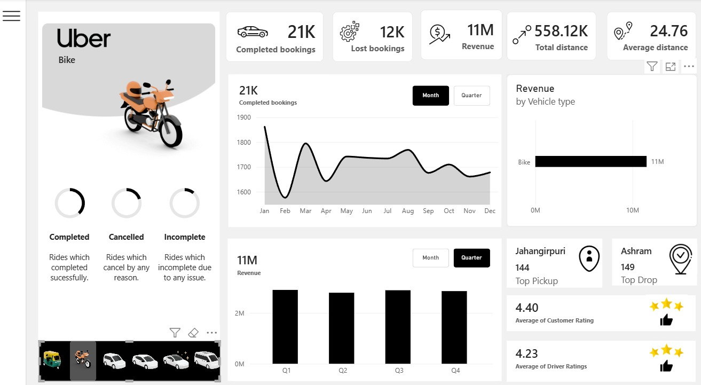
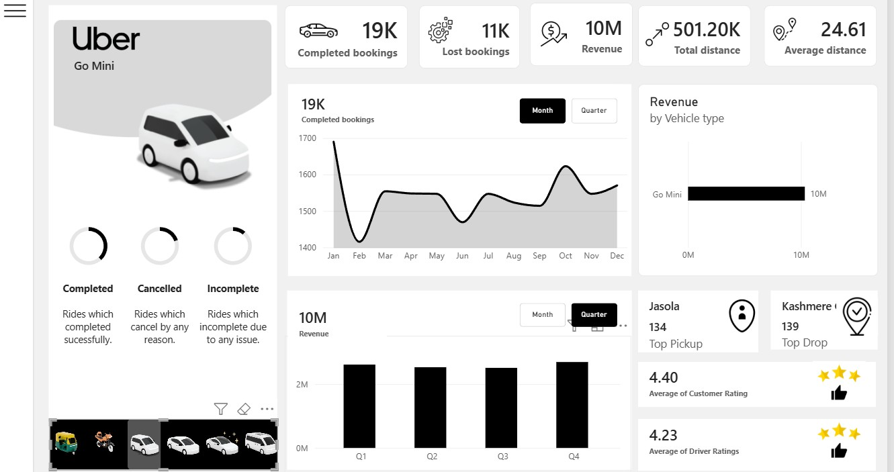
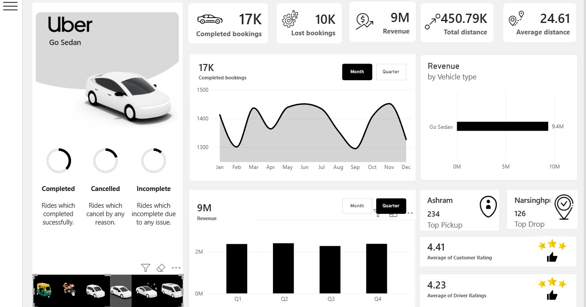
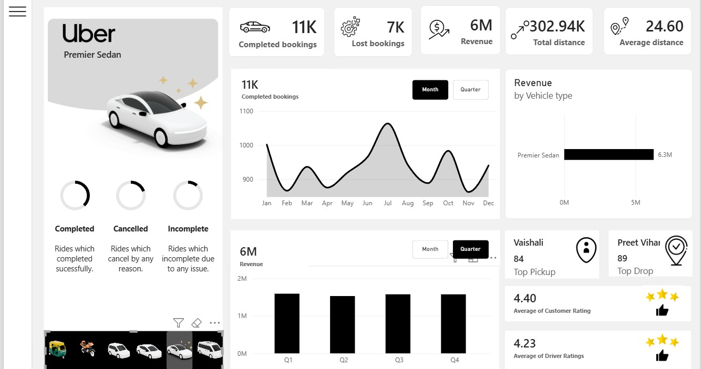
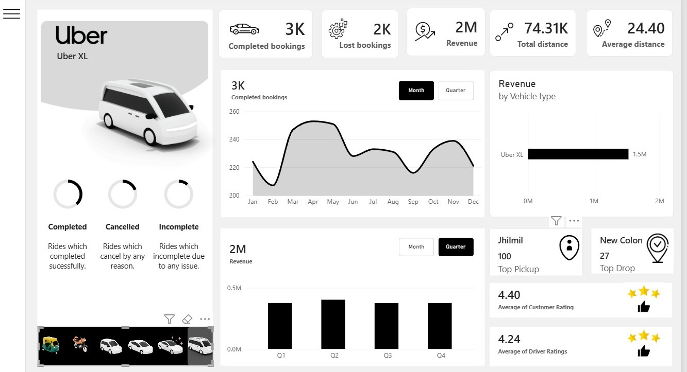

# Uber Operations & Supply-Demand Analytics Dashboard


An end-to-end Power BI analytics project analyzing **150,000+ ride booking records** across multiple vehicle tiers (*Auto, Bike, Go Mini, Go Sedan, Premier Sedan, and Uber XL*). 

This dashboard provides interactive performance tracking for operational fulfillment, lost demand drivers, category-wise revenue distribution, geographic route corridor dynamics, and customer/driver rating distributions.

---

## 📌 Executive Summary & Key Findings

* **Overall Volume & Revenue:** Analyzed **93K completed bookings** generating **₹52M in total revenue** across a total distance of **2.51M km** (Average distance per trip: **~24.6 km**).
* **Lost Demand Bottleneck:** Identified a **~38% lost-booking baseline** (~57K lost bookings across cancelled and incomplete categories) spanning all vehicle tiers, indicating systemic supply-demand friction during peak booking windows.
* **Core Revenue Drivers:** Low-cost micro-mobility and commuter transit tiers (**Auto** and **Bike**) lead overall volume and revenue generation, contributing over **50% of total revenue** (₹24M combined).
* **Geographic Micro-Clusters:** Isolated high-density demand corridors (e.g., *Badarpur* with 326 top pickups for Auto; *Ashram* with 234 pickups for Sedans; *Jahangirpuri* for Bike demand).
* **Distance & Rating Uniformity:** Average trip distances remain consistent across vehicle types (**24.4 km – 24.7 km**), while satisfaction ratings show uniform distribution (**4.40 Customer Rating / 4.23 Driver Rating**).

---

## 📷 Dashboard Screenshots

| Main Overview & Auto Fleet | Bike Category Performance |
| :---: | :---: |
|  |  |

| Go Mini Tier Analysis | Go Sedan Performance |
| :---: | :---: |
|  |  |

| Premier Sedan Breakdown | Uber XL Fleet Analytics |
| :---: | :---: |
|  |  |

---

## 📊 Vehicle Tier Breakdown

| Vehicle Category | Completed Bookings | Lost Bookings | Revenue (INR) | Primary Pickup Hotspot | Avg. Distance |
| :--- | :---: | :---: | :---: | :--- | :---: |
| **Auto** | 23K | 14K | ₹13M | Badarpur (326) | 24.62 km |
| **Bike** | 21K | 12K | ₹11M | Jahangirpuri (144) | 24.76 km |
| **Go Mini** | 19K | 11K | ₹10M | Jasola (134) | 24.61 km |
| **Go Sedan** | 17K | 10K | ₹9M | Ashram (234) | 24.61 km |
| **Premier Sedan** | 11K | 7K | ₹6M | Vaishali (84) | 24.60 km |
| **Uber XL** | 3K | 2K | ₹2M | Jhilmil (100) | 24.40 km |

---

## 🛠 Dashboard Features & Architecture

* **Category Navigation Bar:** Dynamic vehicle icons allowing seamless single-click filtering across all 6 service tiers.
* **KPI Header Cards:** Real-time summary tracking for *Completed Bookings, Lost Bookings, Total Revenue, Total Distance,* and *Average Distance*.
* **Fulfillment Funnel Visuals:** Donut charts breaking down Completed vs. Cancelled vs. Incomplete trips.
* **Trend Analysis:** 
  * Monthly line charts showing booking volume fluctuation patterns.
  * Quarterly bar charts highlighting revenue performance progression.
* **Geographic & Rating Insights:** Dedicated visual modules displaying top pickup/drop-off locations and dual rating metrics.

---

## 📐 Data Architecture & DAX Measures

The data model utilizes a Star Schema with a central `uber` fact table linked to `Calendar` and vehicle reference tables (`img`). Key DAX calculations include:

```dax
// Total Unique Booking Count
Booking_count = DISTINCTCOUNT(uber[Booking ID])

// Completed Bookings (Filtered to successful rides)
completed_bookings = 
CALCULATE(
    [Booking_count], 
    uber[Booking Status] = "Completed"
)

// Lost Bookings (Cancelled & Incomplete rides)
lost_bookings = 
CALCULATE(
    [Booking_count], 
    uber[Booking Status] <> "Completed"
)

// Total Revenue
Booking_value = SUM(uber[Booking Value])

// Distance Aggregations
Total_distance = SUM(uber[Ride Distance])
Avg_distance = AVERAGE(uber[Ride Distance])

// Baseline Volume (Ignores status filters for ratio calculations)
booking_remove_status_filter = 
CALCULATE(
    [Booking_count], 
    ALL(uber[Booking Status])
)

// Analytical Conversion Metrics
Completion_Rate = DIVIDE([completed_bookings], [Booking_count], 0)
Lost_Booking_Rate = DIVIDE([lost_bookings], [Booking_count], 0)
```
